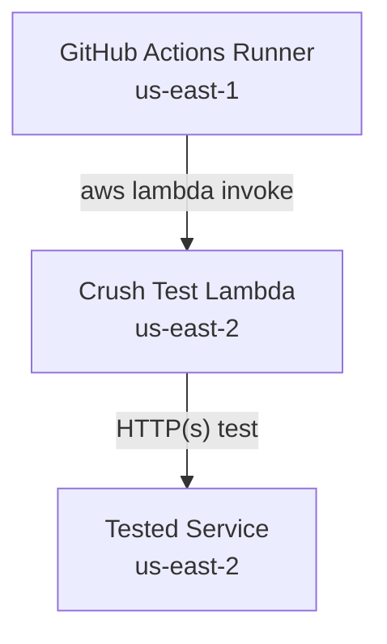

# Crush Test: Regionally Accurate Load Testing with AWS Lambda

Crush Test enables you to run high-performance load tests (using [`oha`](https://github.com/hatoo/oha) or [`k6`](https://k6.io/)) directly from AWS Lambda, in the same AWS Region as your deployed service. This is especially useful when running performance tests as part of CI/CD (e.g., GitHub Actions), allowing you to avoid the network variability and latency of running tests from external runners.

---

## 📊 Architecture Overview



- **GitHub Actions Runner** (in `us-east-1`) uses the AWS CLI to invoke the Crush Test Lambda.
- **Crush Test Lambda** (in `us-east-2`) runs the load test tool in the same region as the service under test, ensuring the lowest and most consistent RTT.

---

## 🚀 Quick Start

| Resource                | Location / Link                                                                                 |
|-------------------------|-------------------------------------------------------------------------------------------------|
| CDK Construct README    | [packages/cdk-construct/README.md](./packages/cdk-construct/README.md)                          |
| CDK Construct API Docs  | [packages/cdk-construct/API.md](./packages/cdk-construct/API.md)                                |

### Install the CDK Construct

```sh
npm install @pwrdrvr/crush-test-cdk
# or
yarn add @pwrdrvr/crush-test-cdk
```

---

## 🧩 Example: Invoking Crush Test Lambda from GitHub Actions

You can invoke the Lambda from a GitHub Actions runner (or any machine with AWS CLI access):

```sh
aws lambda invoke \
  --cli-read-timeout 120 \
  --function-name <your-lambda-name> \
  --payload '{"tool":"k6","args":["run"],"env":{"TARGET_URL":"https://service.example.com/route"},"testProfile":{"base64Content":"<base64-encoded-k6-script>"},"labels":{"gha_run":"123","test":"api"}}' \
  response-k6.json
```

- **tool**: `"k6"` or `"oha"`
- **args**: Arguments for the tool (e.g., `["run","-"]` for k6)
- **stdin**: For k6, provide the test script as a base64-encoded string (see below)
- **labels**: Any key-value pairs; echoed back in the response for easy identification

#### Encoding a k6 Profile as Base64

```sh
base64 -w 0 my-k6-script.js
```

Then use the output as the value for `"stdin"` in your payload.

#### Example k6 Invocation

```sh
aws lambda invoke \
  --function-name <your-lambda-name> \
  --payload '{"tool":"k6","args":["run"],"env":{"TARGET_URL":"https://service.example.com/route"},"testProfile":{"base64Content":"<base64-encoded-k6-script>"},"labels":{"gha_run":"123","test":"api"}}' \
  response-k6.json
```

#### Example oha Invocation

```sh
aws lambda invoke \
  --function-name <your-lambda-name> \
  --payload '{"tool":"oha","args":["-n","1000","-c","20","https://service.example.com/route"],"env":{"TOKIO_WORKER_THREADS":"1"},"labels":{"gha_run":"123","test":"api"}}' \
  response-oha.json
```

---

## 🏷️ Label Echoing

Any labels you include in the `labels` field of your payload are echoed back in the Lambda's response. This makes it easy to correlate response files with the requests that generated them, especially when running multiple tests in parallel.

---

## ⚠️ CPU Limit and CPU Throttling

**Important:**  
Take care to avoid hitting the CPU limit of the Lambda function. If the Lambda is throttled due to CPU exhaustion, the timing and accuracy of your performance tests will be impacted. For best results, allocate sufficient memory (and thus CPU) to your Lambda function for your expected test load.

---

## 📦 Example Responses

Example response files for both oha and k6 are provided:

- [samples/response-oha.json](./samples/response-oha.json)
- [samples/response-k6.json](./samples/response-k6.json)

Example responses with body extracted and `JSON.parse`d are also provided:

- [samples/response-oha.body.json](./samples/response-oha.body.json)
- [samples/response-k6.body.json](./samples/response-k6.body.json)

The structure of these responses is defined by the output of:
- `oha -j` (for oha)
- `k6 --summary-export` (for k6)

**Caveats:**
- Time values in k6's output are in **milliseconds (ms)**.
- Time values in oha's output are in **seconds**.

You may find these scripts useful for parsing or post-processing the returned results:
- [scripts/extract-body.js](./scripts/extract-body.js)
- [scripts/trim-precision.js](./scripts/trim-precision.js)

---

## 📝 License

MIT License. See [LICENSE](./packages/cdk-construct/LICENSE) for details.

# Latest Smoke Test Results

<!-- perf-table:start -->

### 🚀 Performance Test Results

| Metric | Deploy Oha | Deploy K6 | Deploy Packaged Oha | Deploy Packaged K6 |
|--------|-----------:|----------:|--------------------:|-------------------:|
| Total Requests | 10 | 1,190 | 10 | 1,596 |
| Overall RPS | 2,135.9 | 396.3 | 2,059.9 | 531.3 |
| Min Response Time (ms) | 1.75 | 1.72 | 2.37 | 2.27 |
| p50 Response Time (ms) | 6.03 | 4.27 | 6.53 | 3.89 |
| p90 Response Time (ms) | 19.18 | 584.51 | 22.40 | 6.28 |
| p95 Response Time (ms) | 32.89 | 839.39 | 29.99 | 8.63 |

<!-- perf-table:end -->
